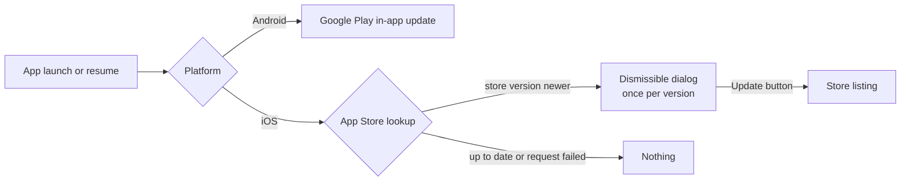

# Customization guide

How to turn a fresh clone of Bedrock into your own app. Every section lists the exact files to touch, what the backend must provide, and the defaults you can keep.

> [!TIP]
> Most of this is automated. Open the repo with Claude Code and run the `project-setup` skill, or use the `/project-setup` prompt with GitHub Copilot. Come back here when you need to understand or adjust a single piece by hand.

## Checklist for a new project

- [ ] Rename the app, package, and bundle identifiers
- [ ] Set the API base URLs and check the endpoint paths
- [ ] Configure deep link scheme and hosts
- [ ] Wire Firebase per flavor (or skip it, everything degrades gracefully)
- [ ] Replace branding assets and regenerate icons and splash screens
- [ ] Set the App Store id for update and review flows
- [ ] Implement the two backend contracts below (session device info, version status)
- [ ] Harden for release (signing, certificate pinning)

## 1. Identity

| What | Where |
| --- | --- |
| Dart package name | `pubspec.yaml` (`name:`), then every `package:bedrock/` import |
| Display name | `appName` in `lib/main_dev.dart` and `lib/main_prod.dart`, `resValue` entries in `android/app/build.gradle.kts`, `APP_DISPLAY_NAME` in `ios/Runner.xcodeproj/project.pbxproj` |
| Android package | `namespace` and `applicationId` in `android/app/build.gradle.kts`, `MainActivity.kt` path and `package` declaration |
| iOS bundle id | `PRODUCT_BUNDLE_IDENTIFIER` values in `project.pbxproj` (dev configurations keep the `.dev` suffix) |
| App title (localized) | `appTitle` in `assets/l10n/app_en.arb` and `app_fr.arb`, then `flutter gen-l10n` |

## 2. API configuration

Each flavor entry point builds an immutable `AppConfig`:

```dart
AppConfig(
  flavor: .prod,
  appName: 'My App',
  apiBaseUrl: 'https://api.example.com',
  appStoreId: '1234567890',
  deepLinkHost: 'app.example.com',
)
```

Endpoint paths carry their own version prefix and live in `AuthEndpoints` (`lib/core/config/app_config.dart`). Defaults:

| Purpose | Default path |
| --- | --- |
| Sign in | `/v1/auth/login` |
| Token refresh | `/v1/auth/refresh` |
| Sign out | `/v1/auth/logout` |
| Profile | `/v1/me` |

Override any of them per flavor:

```dart
AppConfig(
  // ...
  authEndpoints: AuthEndpoints(signIn: '/v2/sessions'),
)
```

### Headers sent on every request

`ClientInfoInterceptor` and `LocaleInterceptor` decorate every request from every client (including the token refresh client):

| Header | Example | Source |
| --- | --- | --- |
| `X-App-Version` | `1.4.2` | `package_info_plus` |
| `X-Build-Number` | `58` | `package_info_plus` |
| `X-Platform` | `android` / `ios` | `device_info_plus` |
| `X-OS-Version` | `17.5` | `device_info_plus` |
| `X-Device-Id` | `4fd6…` (UUID v4) | Generated once, kept in secure storage |
| `Accept-Language` | `fr-FR` | Locale setting, falls back to the system locale |

> [!NOTE]
> The device id is an install id: it is generated on first launch and survives app updates. On iOS it also survives reinstalls (keychain); on Android it resets when the user clears app data or reinstalls. No hardware identifier is ever read.

## 3. Backend contract

### Session creation (stateful auth)

`POST /v1/auth/login` receives the credentials plus a `device` object. Store it with the server-side session so users can review and revoke devices later:

```json
{
  "email": "user@example.com",
  "password": "…",
  "device": {
    "device_id": "4fd6a2e8-6f5b-4d1c-9a3e-8b2f0c7d5e1a",
    "platform": "android",
    "os_version": "15",
    "model": "Pixel 9",
    "manufacturer": "Google",
    "app_version": "1.4.2",
    "build_number": "58"
  }
}
```

### App updates

App updates are handled entirely by the platform stores and need nothing from your backend.

- **Android:** `AppUpdateService` runs [Google Play in-app updates](https://developer.android.com/guide/playcore/in-app-updates) through the `in_app_update` package. On launch and on resume (throttled to once per 6 hours) it asks Play whether an update is available and, when one is, starts the flexible flow (falling back to immediate). Play renders the prompt and the download UI itself. This only triggers for builds installed from Play (the store or an internal testing track), never for debug or sideloaded builds.
- **iOS:** there is no native in-app update API, so `AppUpdateService` queries Apple's public App Store lookup endpoint (`https://itunes.apple.com/lookup?bundleId=...`) for the published version and compares it with the installed one. When the store is ahead, `AppUpdateGate` shows a dismissible dialog once per version and remembers the version the user dismissed.



Opening the listing on iOS needs `appStoreId` (the numeric id from App Store Connect) on `AppConfig`; Android needs nothing.

## 4. Deep links

Configuration lives in three places:

| What | Where |
| --- | --- |
| Custom scheme | `deepLinkScheme` in `lib/core/config/app_config.dart`, `<data android:scheme=…>` in `AndroidManifest.xml`, `CFBundleURLSchemes` in `ios/Runner/Info.plist` |
| HTTPS host per flavor | `deepLinkHost` in each entry point, `manifestPlaceholders["deepLinkHost"]` in `android/app/build.gradle.kts`, `DEEP_LINK_HOST` in `project.pbxproj` |
| Route handling | `go_router` matches the path, the `redirect` guard sends unauthenticated users to sign in and back after login |

For verified HTTPS links you must also publish two files on each host:

<details>
<summary><strong>Android: assetlinks.json</strong></summary>

Serve at `https://app.example.com/.well-known/assetlinks.json`:

```json
[
  {
    "relation": ["delegate_permission/common.handle_all_urls"],
    "target": {
      "namespace": "android_app",
      "package_name": "com.acme.myapp",
      "sha256_cert_fingerprints": ["AA:BB:…"]
    }
  }
]
```

Get the fingerprint with `keytool -list -v -keystore <keystore>` or from the Play Console (App signing).

</details>

<details>
<summary><strong>iOS: apple-app-site-association</strong></summary>

Serve at `https://app.example.com/.well-known/apple-app-site-association` with `Content-Type: application/json`:

```json
{
  "applinks": {
    "details": [
      {
        "appIDs": ["TEAMID.com.acme.myapp"],
        "components": [{ "/": "/*" }]
      }
    ]
  }
}
```

The associated domain (`applinks:app.example.com`) is derived from `DEEP_LINK_HOST` in the Runner entitlements.

</details>

## 5. Firebase

Run once per flavor and paste the generated values:

```sh
flutterfire configure   # select the dev project, copy into firebase_options_dev.dart
flutterfire configure   # select the prod project, copy into firebase_options_prod.dart
```

Set `configured = true` in each file. Without it the app runs fine: crash reporting and push notifications simply stay off.

## 6. Branding

1. Replace the images in `assets/branding/` (keep the file names).
2. Update the seed color in `lib/app/theme/app_colors.dart` and the colors in `flutter_launcher_icons-*.yaml` and `flutter_native_splash.yaml`.
3. Regenerate:

```sh
make icons splash
```

## 7. Localization

1. Add `assets/l10n/app_<code>.arb` with every key from `app_en.arb`.
2. Add the `Locale` to the language selector in `lib/features/settings/presentation/pages/settings_page.dart`.
3. Run `flutter gen-l10n`.

Every user-facing string goes through `context.l10n`; the compiler fails on missing keys, so an incomplete translation cannot ship silently.

## 8. Review prompts

`AppReviewService` asks for a store rating through the native in-app dialog. Defaults, all overridable in `lib/core/di/injector.dart`:

| Condition | Default |
| --- | --- |
| Minimum sessions | 5 |
| Minimum time since first session | 3 days |
| Minimum time between prompts | 90 days |

Sessions are counted by `AppLifecycleHandler` (cold start plus each return to the foreground), and the prompt is attempted when the app comes back to the foreground. For higher-quality reviews, also call `maybeRequestReview()` after a moment of success in your own features; the thresholds make repeated calls safe.

## 9. Release hardening

- [ ] Create a keystore and `android/key.properties` (gitignored)
- [ ] Pin your API certificates in `android/app/src/main/res/xml/network_security_config.xml`
- [ ] Keep `build/symbols` from `make apk` / `make aab` / `make ipa` to deobfuscate Crashlytics traces
- [ ] Verify the update flow end to end: on Android push a higher build to an internal testing track and confirm Play prompts to update; on iOS confirm the dialog appears once the App Store version is ahead of the installed one
